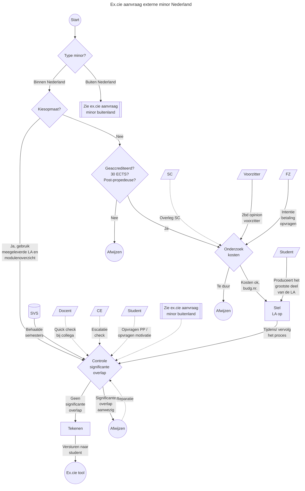

# Aanvraag externe minor
Zie [de beleidswiki](https://beleidswiki.fhict.nl/doku.php?id=beleid:minoren), in het gehele minorproces zit de toestemming voor het volgen van een minor relatief laat.
Deze aanvragen worden behandeld door Examenkamer D.
Grofweg zijn deze aanvragen op te delen in externe minors in Nederland en daarbuiten.
In de [Examboard tool](https://examboard.fhict.nl/) vallen deze aanvragen onder de categorie `minor`.

## Doel
De ex.cie ziet er op toe dat er geen significante overlap zit in de al eerder "uitbetaalde" ECTS. De student is vrij om een minor te kiezen die: geaccrediteerd 30 ECTS uitbetaald; in een post-propedeuse fase zit; met een zelfgekozen onderwerp.

## Terminologie
| Term | Beschrijving |
| --- | --- |
| SC/ CE/ FZ/ SVS | Fontys ICT afkortingen voor: semester coach (sc); curriculum eigenaar (CE); Financiale zaken/ finance (FZ); Studentenvolg (SVS). |
| LA | Learning Agreement, document waarop de ex.cie haar handtekening zet ter goedkeuring. |
| Kiesopmaat | Kiestopmaat is [een website](https://kiesopmaat.nl) waarop samenwerkende hogescholen en universiteiten hum minors publiceren. Deze minors hebben onderling afspraken met betrekking tot de facturatieen zijn daarnaast voorzien van LA's en modulebeschrijvingen. |
| Opleidingsminor | Fontys ICT minor waarbij de doorstroom ingeregeld is via het OER/ opleidingsgids. Toestemming aanvragen bij de ex.cie is niet nodig. |
| Fontys-minor | Fontys-breede minor waarbij de doorstroom ingeregeld is via het OER/ opleidingsgids. Toestemming aanvragen bij de ex.cie is niet nodig. |
| Schakelminor | Minor (pre-master) waarbij de doorstroom ingeregeld is via het OER/ opleidingsgids. Toestemming aanvragen bij de ex.cie is niet nodig. |
| Externe minor | Minor waarbij de ex.cie toestemming moet geven. Deze procedure richt zich op dit type minor. |

## Procedure externe minor in Nederland
Deze procedure in dit hoofdstuk richt zich op de aanvraag voor een externe minor in Nederland (al dan niet via kiesopmaat).

### Belangrijke (beslis)momenten
Een kiesopmaat minor versnelt het process aanzienlijk. Waar er geen kiesopmaat aanvrag wordt ingediend moet er worden gecontroleerd op: accreditatie (nvao); het niveau (post-propedeuse); en of het 30 ECTS is.

Een student die op externe minor gaat kost Fontys ICT ongeveer 3800 euro. Het onderzoek naar de kosten kun je neerleggen bij de student in een extra motivatie die bijvoorbeeld gesteund moet worden door de semester coach. Controleer bij FZ of deze minor/ partij binnen het budget/ beleid valt. De partij heeft vaak zelf een LA die getekend moet worden met de financiele details (budgetnummers, factuuradres, e.d.). Indien die niet aanwezig is, laat de student/ stel samen met de student de LA op. (Tip, gebuik een template uit een eerder verzoek.) Vraag ter controle/ bevestiging feedback aan de voorzitter van de examenkamer.

Het controleren op significante overlap is er om het voorkomen dat er "dubbel ECTS" wordt uitbetaald. Dus dat de student geen minor volgt die dezelfde stof behapt als die uit een eerder gevolgdg semester. Veelal is de inschatting zelf te maken. Soms kun je de evalauatie op overlap af door een docent (of projectleider onderwijsuitvoering) uit een semester te vragen gerelateerd aan de minor. De uiteindelijke escalatie is altijd de CE. De CE heeft kennis van het complete curriculum en kan het uiteindelijk het beste inschatten. N.b. soms is het ook handig om de student te vragen "wat verwacht je meer te leren in minorvak XYZ dan je al hebt geleerd in een eerder semester?", dat maakt het lezen van de minormodulebeschrijvingen gerichter/ sneller.

Bij studenten waarbij je in SVS geen inzicht hebt op de kennis, vraag je het competence/ personalized programme op.

Het gebeurd zelden dat een minor wordt afgewezen, vaak wordt er een minorvak gewisseld om overlap tegen te gaan. Dat is de "reparatie" pijl (vaak tijdrovend).

Het valt op dat er op "significante overlap" getoetst wordt zonder dit te specificeren. Wat is significant? De voorkeur is om hier geen arbitrair getal aan te hangen. (Echter persoonlijk bij een buitenlandervaring vind ik meer dan 5 ECTS significant.)

### Voorbeeld van communicatie

Ex.cie _- bij vermoeden van significante overlap_
>>>>Als examenkamer moeten we controleren dat we niet twee keer ECTS "uitbetalen" aan al geleerde kennis.
>>>>
>>>>Normaal doe ik een simpele toets of vraag ik het de curriculum eigenaar (2nd opinion). In jouw geval heb ik dat nog niet gedaan omdat ik zelf denk dat er te veel overlap zit in wat je al weet en wat je daar gaat leren. Ik maak dat op aan het eerste zinnetje in het minorcoursevak (Programming 2): “Build simple object-oriented (OO) applications”; dat is iets wat je bij ons in semester 2 geleerd hebt.
>>>>
>>>>Is het mogelijk een andere minorcoursevak te kiezen voor Programming 2?
>>>
>>>Erg jammer, ik denk namelijk dat het harstikke veel toegevoegde waarde had om programming 2 te doen. Semester 2 was, door aan/afwezigheid van docenten, een chaotisch semester waarin ik niet het beeld heb dat ik over dit onderwerp genoeg achtergrond kennis heb opgedaan. Hoewel ik het semester wel heb gehaald, valt er nog genoeg te leren.
>>>
>>> Mocht jullie bij het standpunt blijven is "Studio 6, Extend your IT skills within large,complex, client driven IT projects, while engaging with advanced study in specialist areas." mijn 2e keuze.
>>
>>Als je voor beide miniorvakcourses een sylabus kunt regelen, graag. De Programming_2-sylabus gebruiken we dan voor de 2nd opinion van je eerste keuze. (Dit proces start pas als we de sylabus hebben.)
>>
>>Als dat niet lukt - of het komt uit de 2nd opinion toch als te veel overlap terug - dan gebruiken we de andere sylabus  om te toetsen of Studio_6 iets is met minder overlap.
>>
>>Just to be sure: heb je een deadline om eea in te regelen dat je weet? (Sommige minors sluiten qua inschrijving vaak op 31 mei - ik weet niet of dat hier het geval is.)
>
>ik heb de syllabussen van beide courses ontvangen, in de bijlage heb ik deze meegestuurd. Verder heb ik gekeken naar de deadline maar er wordt nergens weergegeven in de mails die ik heb ontvangen dat ik voor een bepaalde datum mijn keuzes moet hebben bepaald, behalve voor het semester begint.
>
>Kijkend naar de syllabus kan ik mij voorstellen dat de 2nd opinion ook niet eens is met het volgen van programming 2. Mijn voorstel is om Studio 5 van Information Technology en Introduction to Sport (30 credits) van Institute of Sport, Exercise and Health te volgen. De beschrijving die hierbij hoort is als volgt: "The aim of this course is to enable learners touse sport related concepts and skills to critically reflect on a range of experiences within the sport industry."

Intern
>>Dag Ruben, Als service, kun je toch een 2nd opinion doen? (Ik had het afgekeurd ivm te veel overlap Semester 2 Software.)
>
>Programming 2 is bijna letterlijk S2 (of eigenlijk SE2 van het oude curriculum zelfs). Er waren inderdaad destijds wat issues met docenten in S2 die plotseling uit dienst gingen, maar ik denk eigenlijk niet dat ze ondanks dat daar veel bij gaat leren. Dus: teveel overlap inderdaad. Groet, Ruben

## Procedure externe minor buiten Nederland
Deze procedure richt zich op de aanvraag voor een externe minor buiten Nederland.

Volgt nog.
