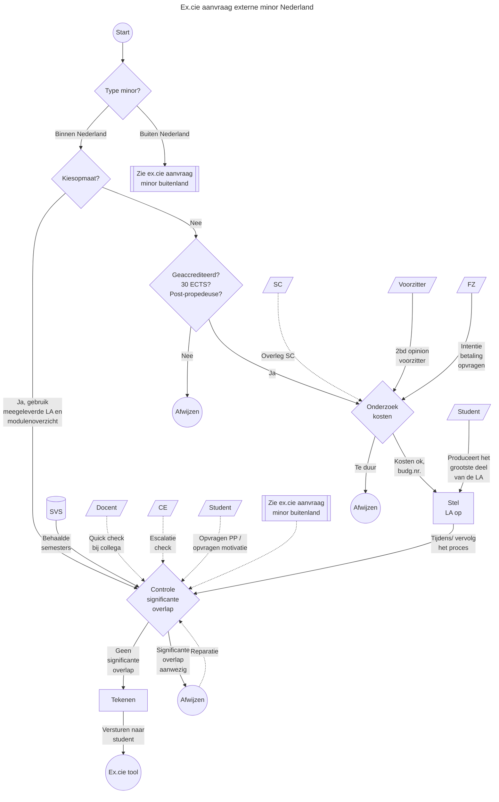
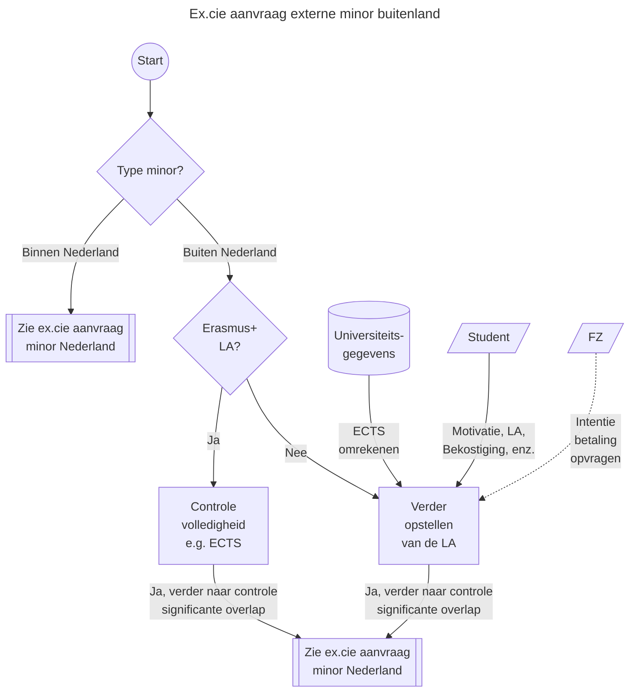

# Aanvraag externe minor
Zie [de beleidswiki](https://beleidswiki.fhict.nl/doku.php?id=beleid:minoren), in het gehele minorproces zit de toestemming voor het volgen van een minor relatief laat.
Deze aanvragen worden behandeld door Examenkamer D.
Grofweg zijn deze aanvragen op te delen in externe minors in Nederland en daarbuiten.
In de [Examboard tool](https://examboard.fhict.nl/) vallen deze aanvragen onder de categorie `minor`.

## Doel
De ex.cie ziet er op toe dat er geen significante overlap zit in de al eerder "uitbetaalde" ECTS. De student is vrij om een minor te kiezen die: geaccrediteerd 30 ECTS uitbetaald; in een post-propedeuse fase zit; met een zelfgekozen onderwerp.

## Terminologie
| Term | Beschrijving |
| --- | --- |
| SC/ CE/ FZ/ SVS | Fontys ICT afkortingen voor: semester coach (sc); curriculum eigenaar (CE); Financiale zaken/ finance (FZ); Studentenvolg (SVS). |
| LA | Learning Agreement, document waarop de ex.cie haar handtekening zet ter goedkeuring. |
| Kiesopmaat | Kiestopmaat is [een website](https://kiesopmaat.nl) waarop samenwerkende hogescholen en universiteiten hum minors publiceren. Deze minors hebben onderling afspraken met betrekking tot de facturatieen zijn daarnaast voorzien van LA's en modulebeschrijvingen. |
| Opleidingsminor | Fontys ICT minor waarbij de doorstroom ingeregeld is via het OER/ opleidingsgids. Toestemming aanvragen bij de ex.cie is niet nodig. |
| Fontys-minor | Fontys-breede minor waarbij de doorstroom ingeregeld is via het OER/ opleidingsgids. Toestemming aanvragen bij de ex.cie is niet nodig. |
| Schakelminor | Minor (pre-master) waarbij de doorstroom ingeregeld is via het OER/ opleidingsgids. Toestemming aanvragen bij de ex.cie is niet nodig. |
| Externe minor | Minor waarbij de ex.cie toestemming moet geven. Deze procedure richt zich op dit type minor. |
| Erasmus+ LA | Een learning agreement in het Erasmus+-format voor minors bij (cluster)partner universiteiten. (Denk: de "kiesopmaat"-variant voor buitenland-minoren.) |
| Study Abroad | Zowel een afdeling binnen Fontys als Fontys ICT ter ondersteuning voor o.a. minors in het buitenland. |
| Mobility online | Een dienst (checklist-website) gebruikt door Fontys (ICT) Study Abroad welke bijhoud in welke vast de student is m.b.t. de buitenland minor. |
| (Cluster) partner universiteit | Universiteit waar Fontys (partner) danwel ons cluster domein (Educatie, cluster partner) [afspraken mee hebben gemaakt](https://www.fontys.nl/en/Fontys-Study-Abroad/Minor-abroad.htm) voor onderlinge uitwisseling via het Erasmus+ programma. |

## Procedure externe minor in Nederland
Deze procedure in dit hoofdstuk richt zich op de aanvraag voor een externe minor in Nederland (al dan niet via kiesopmaat).

### Uitzonderingen op de procedure
 * Wellicht goed om te weten dat een student meerdere LA's kan laten tekenen (bijv. in het geval van loting) met alternatieven op de eerste minorkeuze.

### Belangrijke (beslis)momenten
Een kiesopmaat minor versnelt het process aanzienlijk. Waar er geen kiesopmaat aanvrag wordt ingediend moet er worden gecontroleerd op: accreditatie (nvao); het niveau (post-propedeuse); en of het 30 ECTS is.

Een student die op externe minor gaat kost Fontys ICT ongeveer 3800 euro. Het onderzoek naar de kosten kun je neerleggen bij de student in een extra motivatie die bijvoorbeeld gesteund moet worden door de semester coach. Controleer bij FZ of deze minor/ partij binnen het budget/ beleid valt. De partij heeft vaak zelf een LA die getekend moet worden met de financiele details (budgetnummers, factuuradres, e.d.). Indien die niet aanwezig is, laat de student/ stel samen met de student de LA op. (Tip, gebuik een template uit een eerder verzoek.) Vraag ter controle/ bevestiging feedback aan de voorzitter van de examenkamer.

Het controleren op significante overlap is er om het voorkomen dat er "dubbel ECTS" wordt uitbetaald. Dus dat de student geen minor volgt die dezelfde stof behapt als die uit een eerder gevolgdg semester. Veelal is de inschatting zelf te maken. Soms kun je de evalauatie op overlap af door een docent (of projectleider onderwijsuitvoering) uit een semester te vragen gerelateerd aan de minor. De uiteindelijke escalatie is altijd de CE. De CE heeft kennis van het complete curriculum en kan het uiteindelijk het beste inschatten. N.b. soms is het ook handig om de student te vragen "wat verwacht je meer te leren in minorvak XYZ dan je al hebt geleerd in een eerder semester?", dat maakt het lezen van de minormodulebeschrijvingen gerichter/ sneller.

Bij studenten waarbij je in SVS geen inzicht hebt op de kennis, vraag je het competence/ personalized programme op.

Het gebeurd zelden dat een minor wordt afgewezen, vaak wordt er een minorvak gewisseld om overlap tegen te gaan. Dat is de "reparatie" pijl (vaak tijdrovend).

Het valt op dat er op "significante overlap" getoetst wordt zonder dit te specificeren. Wat is significant? De voorkeur is om hier geen arbitrair getal aan te hangen. (Echter persoonlijk bij een buitenlandervaring vind ik meer dan 5 ECTS significant.)

### Voorbeeld van communicatie
Ex.cie _- bij vermoeden van significante overlap_
>>>>Als examenkamer moeten we controleren dat we niet twee keer ECTS "uitbetalen" aan al geleerde kennis.
>>>>
>>>>Normaal doe ik een simpele toets of vraag ik het de curriculum eigenaar (2nd opinion). In jouw geval heb ik dat nog niet gedaan omdat ik zelf denk dat er te veel overlap zit in wat je al weet en wat je daar gaat leren. Ik maak dat op aan het eerste zinnetje in het minorcoursevak (Programming 2): “Build simple object-oriented (OO) applications”; dat is iets wat je bij ons in semester 2 geleerd hebt.
>>>>
>>>>Is het mogelijk een andere minorcoursevak te kiezen voor Programming 2?
>>>
>>>Erg jammer, ik denk namelijk dat het harstikke veel toegevoegde waarde had om programming 2 te doen. Semester 2 was, door aan/afwezigheid van docenten, een chaotisch semester waarin ik niet het beeld heb dat ik over dit onderwerp genoeg achtergrond kennis heb opgedaan. Hoewel ik het semester wel heb gehaald, valt er nog genoeg te leren.
>>>
>>> Mocht jullie bij het standpunt blijven is "Studio 6, Extend your IT skills within large,complex, client driven IT projects, while engaging with advanced study in specialist areas." mijn 2e keuze.
>>
>>Als je voor beide miniorvakcourses een sylabus kunt regelen, graag. De Programming_2-sylabus gebruiken we dan voor de 2nd opinion van je eerste keuze. (Dit proces start pas als we de sylabus hebben.)
>>
>>Als dat niet lukt - of het komt uit de 2nd opinion toch als te veel overlap terug - dan gebruiken we de andere sylabus  om te toetsen of Studio_6 iets is met minder overlap.
>>
>>Just to be sure: heb je een deadline om eea in te regelen dat je weet? (Sommige minors sluiten qua inschrijving vaak op 31 mei - ik weet niet of dat hier het geval is.)
>
>ik heb de syllabussen van beide courses ontvangen, in de bijlage heb ik deze meegestuurd. Verder heb ik gekeken naar de deadline maar er wordt nergens weergegeven in de mails die ik heb ontvangen dat ik voor een bepaalde datum mijn keuzes moet hebben bepaald, behalve voor het semester begint.
>
>Kijkend naar de syllabus kan ik mij voorstellen dat de 2nd opinion ook niet eens is met het volgen van programming 2. Mijn voorstel is om Studio 5 van Information Technology en Introduction to Sport (30 credits) van Institute of Sport, Exercise and Health te volgen. De beschrijving die hierbij hoort is als volgt: "The aim of this course is to enable learners touse sport related concepts and skills to critically reflect on a range of experiences within the sport industry."

Intern
>>Dag Ruben, Als service, kun je toch een 2nd opinion doen? (Ik had het afgekeurd ivm te veel overlap Semester 2 Software.)
>
>Programming 2 is bijna letterlijk S2 (of eigenlijk SE2 van het oude curriculum zelfs). Er waren inderdaad destijds wat issues met docenten in S2 die plotseling uit dienst gingen, maar ik denk eigenlijk niet dat ze ondanks dat daar veel bij gaat leren. Dus: teveel overlap inderdaad. Groet, Ruben

### Voorbeeld van bestanden die je tegenkomt
 * Een ingevulde en goedgekeurde Learning agreement van kiesopmaat
 * Een modulebeschrijving van kiesopmaat

## Procedure externe minor buiten Nederland
Deze procedure richt zich op de aanvraag voor een externe minor buiten Nederland.

### Uitzonderingen op de procedure
 * Hoewel de ex.cie moet toezien op geen significante overlap vooraf gaand aan de mobiliteit is dat in Asie (vooral Zuid Korea) vaak niet haalbaar. Daar worden de minorvakken geplubliceerd op borden bij aankomst. Talen en vakken zijn vooraf niet duidelijk. Afspraak hier is dat de student een intentie stuurt om bepaalde minorvakken te volgen zodat de ex.cie kan waarschuwen op overlap. De student kiest dan de minorvakken bij aankomst en maakt zo snel mogelijk een LA. Dit maakt het moeilijker om te controleren op overlap. (Wijzigingen zijn moeilijk door te voeren zodra het eenmaal loopt.)

### Belangrijke (beslis)momenten
Fontys heeft een aantal [partner universiteiten](https://www.fontys.nl/en/Fontys-Study-Abroad/Minor-abroad.htm) waarmee we afspraken hebben gemaakt. Daarmee werken we (vaak binnen de EU) met de Erasmus+-LA. Dit versnelt het proces. Controle is vooral op ECTS (of een ander systeem). Het Erasmus+ heeft ook change requests en andere wijzigingsformulieren voor handen. (Ik denkt dat deze uit/ via mobility online worden gemaakt.)

Verder opstellen LA gaat vaak onder leiding van de student zelf. Een minor in het buitenland trekt de pro-actieve studenten aan die dit zelf vaak goed onder controle hebben.

Sommige minors vereisen een verklaring van een GPA van de student. Deze stellen wij niet meer op. De student kan die eventueel zelf uitrekenen.

Studenten vaak 1 minorvak meer dan nodig (bijv een totaal van 36 ECTS). Bij aankomst kunnen ze dan uitval/ roosterproblemen opvangen (/ of een keuze uitstellen). Daartoe wordt dan een nieuwe LA/ change request ingediend. Soms wordt die vergeten, en dat is niet erg.

### Voorbeeld van communicatie
Student komt uit het technology (en SI) profiel.
>>>>>I am writting to request approval on my Learning Agreement for my Minor Abroad. Please see the attached files!
>>>>>The (.pdf) file is the Learning Agreement generated from MobilityOnline website and the (.docx) file is the LA given me from the Host university.
>>>>
>>>>I’m afraid I cannot yet sign the document. Please review my findings and reply with your motivation/ clarifications.
>>>>
>>>>· Course BCSCe58.1 is missing the description. If unavailable, explain what you expect to learn in that course.
>>>>
>>>>· CCEe05, BCSCe13.2, EEAe26, BCSCe10, all four, in order of severity seem to have significant overlap with your profile and/ or specialization. Explain what you expect to learn more than you already know or learnt in your profile and/ or specialization. Be thorough in our motivation.
>>>
>>>[...]
>>>CCEe05 Computer Systems - 5 ECTS
>>>
>>>In choosing this course, my motivation lies in delving into the intricate details of arithmetic in computer systems, digital devices, and their essential elements. This includes gaining a comprehensive understanding of components such as logical gates, decoders, multiplexers, flip-flops, and registers. I aim to explore the characteristics, organization, action, and expansion of various types of computer memories with a keen interest in their complexities.
>>>
>>>The study of single-chip microcomputers, covering architecture, characteristics, and modes of operation, is particularly intriguing. My intention is to explore the ways of data exchange, including both parallel and sequential methods, as well as parallel-sequential combinations. Understanding the nuances of types of interfaces, with theoretical and practical examples and implementations, will add depth to my knowledge.
>>>
>>>I specifically opted for this course because I aspire to more deeply dive into the topic, approaching it with a theoretical perspective. I am eager to work on a theoretical basis to complement my practical knowledge. I aim to demonstrate that this course goes beyond the scope of my current profile and specialization, offering a more profound exploration of the intricacies involved in computer systems. This theoretical emphasis aligns with my goal of gaining a comprehensive and nuanced understanding of the functionalities of computer systems.
>>>[...]
>>
>>Thanks for your reply. This is ok. I will have to invite a collegue to review your choosen courses. This will add a few days to the process, just so you know.
>
>Thank your for your fast reply! I will eagerly await your reply!
>My deadline for signed and completed acceptance documents of the Host University is December 20th.

De 2nd opinion bij een projectleider onderwijsuitvoering.
>>>>>Ex.cie to PLOU: Given this student SVS LINK (whom you are also a sc of i see now).
>>>>>Could you please review his motivation and assess if there's not too much overlap with his profile (tech) and specialization (si - hence I'm contacting you).
>>>>>Can you provide me with a reply in this tool with your findings?
>>>>
>>>>PLOU: I find the setting of the courses good and it extends the program we offer at FHICT. My only question is about BCSCe13.2 Elective Discipline (List 1) - Embedded system -
>>>>From the description I cannot understand how this course will extend our program of Embedded software. Maybe Student can give more concrete details of the course, on how this course will extend his gained knowledge at FHICT.
>>>
>>>Ex.cie to student: Sorry it took so long. One of my reviewers replied yesterday and had no objections save one course. There is potential for overlap in > BCSCe13.2 Elective Discipline (List 1) - Embedded system -. I therefor ask you to direct studies in that course to have the least amount of overlap possible. (E.g. explore the unknow path in that course.)
>>>Attached are both documents - signed. Enjoy your minor!
>>
>>Student: Thanks for the reply! I will for sure explore the unkown path in the course! Just to let you know from the Host University is still not sure if this couse will be available, so i may need to change it later if its needed but want to express my gratitude for your understanding.
>
>Student (later): I am sending you my Learning Agreement for signuters because of changes.
>Due to wrong documentation and information submitted this subject was originally 5 credits but due to ongoing host university changes, this subject is now 4 credits, and a new subject must be added to make the required 30 credits

LA (change request) getekend; de uiteindelijke minor bestond uit:
 * BCSCe13.2 (Semester 6) Elective Discipline (List 1) - Embedded system. 4 ECTS (was 5)
 * SPRe04 Sports. 1 ECTS
 * BCSCe10 (Semester 6) Development of Linux-based software. 4 ECTS
 * BCSCe14 (Semester 6) Project on selected discipline. 2 ECTS
 * BCSCe58.1 (Semester 8) Marketing in High Technologies. 4 ECTS
 * CCEe05 (Semester 4) Computer Systems. 5 ECTS
 * CCEe08 (Semester 4) Databases. 6 ECTS
 * EEAe26 (Semester 4) Measurements in Communications and Computer Engineering. 4 ECTS

Wat valt op? Een LA komt vaak meerdere malen terug (via change requests) voor minorvakken die niet doorgaan, in een onbekende taal worden gegeven, ECTS die aangepast zijn. Ook zie je dat initieel de behandelaar meer overlap verwachtte dan wat bleek via de PLOU. Wat je ook ziet is soms een wat simpel "filler" minorvak (zoals sports), dat is helemaal prima (wij zijn immers geen sportopleiding).

### Voorbeeld van bestanden die je tegenkomt
 * Erasmus+ ingevulde LA.
