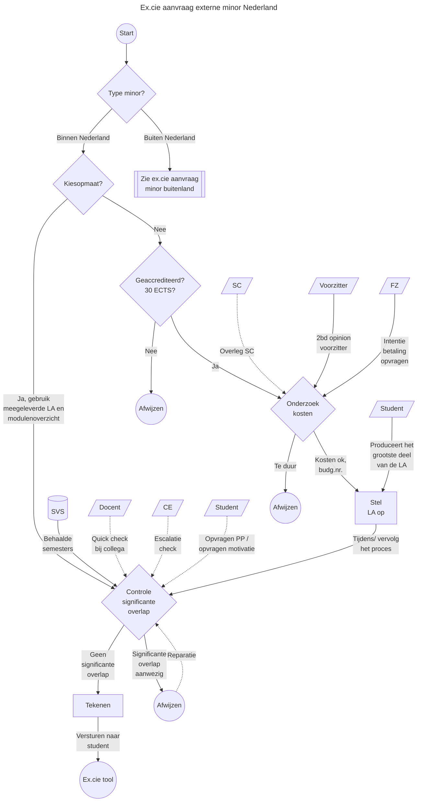

# Aanvraag externe minor
Zie [de beleidswiki](https://beleidswiki.fhict.nl/doku.php?id=beleid:minoren), in het gehele minorproces zit de toestemming voor het volgen van een minor relatief laat in het process.
Deze aanvragen worden behandeld door Examenkamer D.
Grofweg zijn deze aanvragen op te delen in externe minors in Nederland en daarbuiten.

## Doel
De ex.cie ziet er op toe dat er geen significante overlap zit in de al eerder "uitbetaalde" ECTS. De student is vrij om een minor te kiezen die geaccrediteerd 30 ECTS uitbetaald in een post-propedeuse onderwerp.

## Terminologie
| Term | Beschrijving |
| --- | --- |
| LA | Learning Agreement, document waarop de ex.cie haar handtekening zet ter goedkeuring. |
| Kiesopmaat | Kiestopmaat is [een website](https://kiesopmaat.nl) waarop samenwerkende hogescholen en universiteiten hum minors publiceren. Minors die door studenten op die site gekozen worden worden onderling gefactueerd en zijn standaard voorzien van LA's en modulebeschrijvingen. |
| Opleidingsminor | Minor waarbij de doorstroom ingeregeld is via het OER/ opleidingsgids. Toestemming aanvragen bij de ex.cie is hierdoor niet nodig. |
| Fontys-minor | Fontys-breede minor waarbij de doorstroom ingeregeld is via het OER/ opleidingsgids. Toestemming aanvragen bij de ex.cie is niet nodig. |
| Schakelminor | Minor (pre-master) waarbij de doorstroom ingeregeld is via het OER/ opleidingsgids. Toestemming aanvragen bij de ex.cie is niet nodig. |
| Externe minor | Minor waarbij de ex.cie toestemming moet geven. Dit bestand richt zich op de procedure omtrent dit type minor. |

## Procedure externe minor in Nederland
Deze procedure richt zich op de aanvraag voor een externe minor in Nederland.

